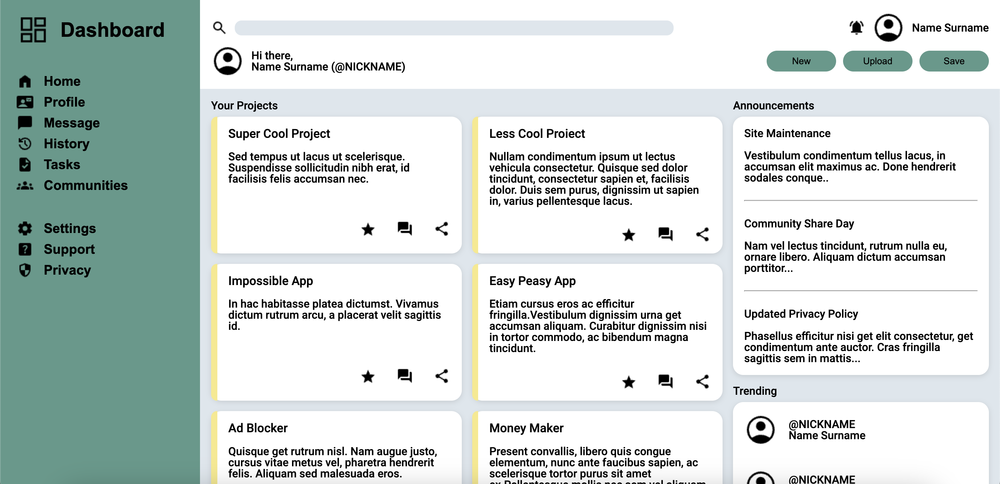

# Project-Admin-Dashboard

## Table of Contents
- [Description](#description)
- [Final Result](#final-result)
- [Project Design Template](#project-design-template)
- [To do](#to-do)

## Description
This is a project admin dashboard for The Odin Project. It is a simple dashboard created using only html and css to practice flexbox and grid. 

## Final Result

## Project Design Template
 

## To do
- [x] Sidebar
    - [x] Profile
    - [x] Messages
    - [x] History
    - [x] Tasks
    - [x] Communities
    - [x] Settings
    - [x] Support
    - [x] Privacy
---

- [x] Navbar
    - [x] Search
    - [x] Notifications
    - [x] Profile Picture
    - [x] Profile Name
    - [x] New Button
    - [x] Upload Button
    - [x] Share Button
---

- [x] Main content
    - [x] Your Projects
    - [x] Anouncements
    - [x] Trending

